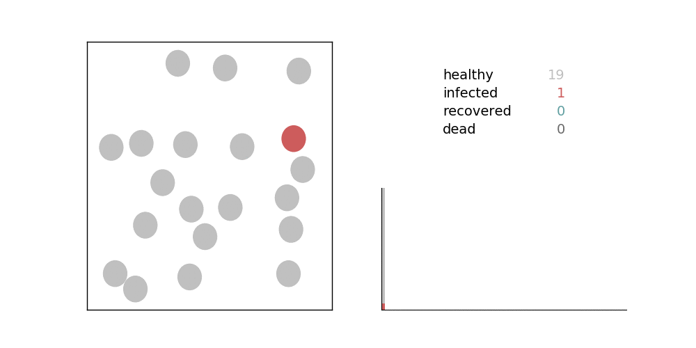
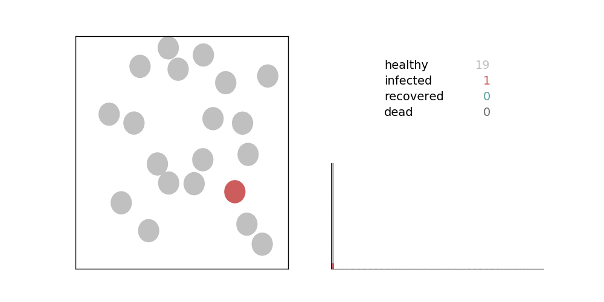

### Covid-19: Simulation of "Flatten the Curve"  

Replication and extension of the simulation in [this Washington Post article](https://www.washingtonpost.com/graphics/2020/world/corona-simulator/)

<!-- No Social Distancing  
  

Social Distancing: 30% of Baseline Contact Ratio  
   -->

Link to interactive notebook: [flatten_the_curve.ipynb](https://nbviewer.jupyter.org/github/rikiyay/covid19/blob/master/flatten_the_curve.ipynb)