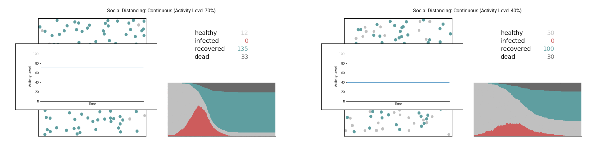
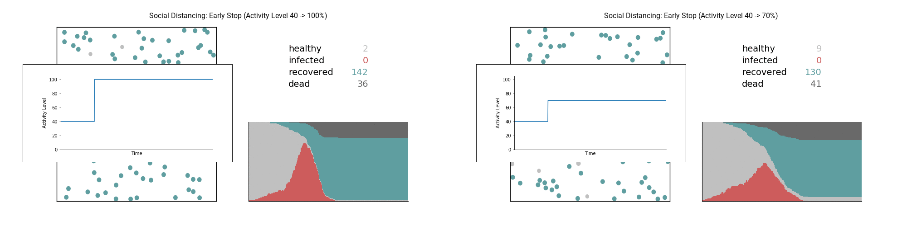
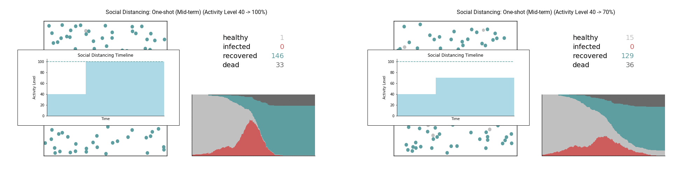
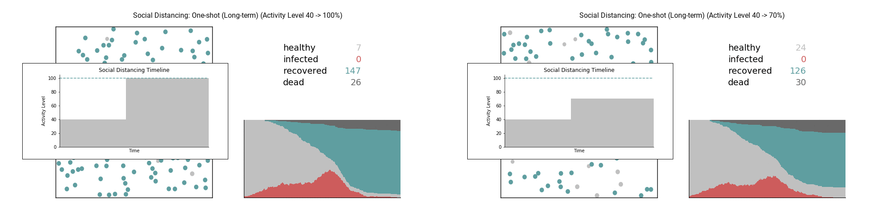
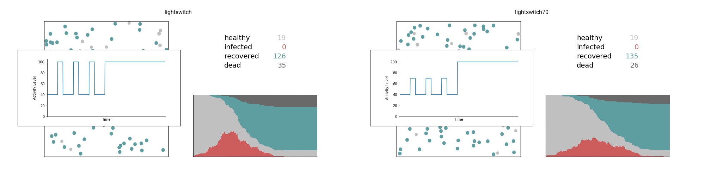
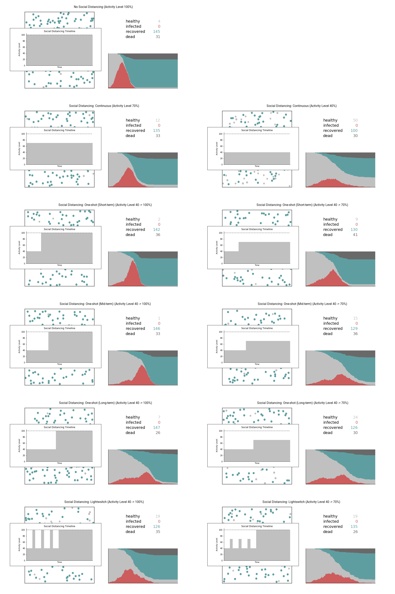

## Simulation: "Flatten the Curve"  
In this repo, we investigate:
- Impact of Social Distancing on "Flattening the Curve"  
- Influence of a Difference in Social Distancing Period  
- Efficacy of the Lightswitch Method (described [here](https://covid-measures.github.io/) by Marissa Childs et al)  
  
---  

### Experiments
  
- Each simulation is shown in GIF  
    - Healthy person is shown in light gray  
    - Infected person is shown in red  
    - Recoverd person is shown in green  
    - Dead person is removed from the simulation  
        - but shown in the counter and stacked area chart in dark gray  

- Each social distancing timeline is displayed on the left of still images  
  
- #### No Social Distancing (Activity Level 100%)  
  
  

- #### Social Distancing: Whole Period  

    - Activity Level 70%  
  

    - Activity Level 40%  
  

  

- #### Social Distancing: Early Stop  

    - Activity Level 40% -> 100%  
  

    - Activity Level 40% -> 70%  
  

  

- #### Social Distancing: Mid Stop  

    - Activity Level 40% -> 100%  
  

    - Activity Level 40% -> 70%  
  

  

- #### Social Distancing: Late Stop  

    - Activity Level 40% -> 100%  
  

    - Activity Level 40% -> 70%  
  

  

- #### Social Distancing: Lightswitch  

    - Activity Level 40% -> 100%  
  

    - Activity Level 40% -> 70%  
  

  

---

### In summary  

- Social distancing does flatten the curve.  
- If we quit social distancing too early, we could still see a surge.  
- Lightswich method could potentially reduce the total social distancing period.  

  
  
---  
  
### Requirements  
- python (`v3.6.9` was used)  
- numpy (`v1.17.2` was used)  
- matplotlib (`v3.1.1` was used)  
  
---  
  
### Link to abbreviated version of interactive:  
- [Notebook](https://nbviewer.jupyter.org/github/rikiyay/covid19/blob/master/notebook/flatten_the_curve.ipynb?flush_cache=true)  
- [HTML](https://htmlpreview.github.io/?https://github.com/rikiyay/covid19/blob/master/notebook/flatten_the_curve.html)  
- [Slide](https://htmlpreview.github.io/?https://github.com/rikiyay/covid19/blob/master/notebook/flatten_the_curve.slides.html)  
  
---  
  
### Acknowledgements  
- This repo is  
    - Inspired by the simulation in [this Washington Post article](https://www.washingtonpost.com/graphics/2020/world/corona-simulator/) by Harry Stevens  
    - Based on [this elastic collision implementation](https://github.com/xnx/collision) by Christian Hill  