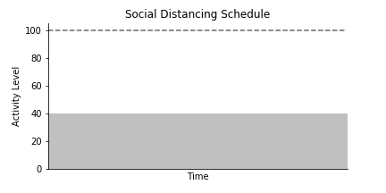
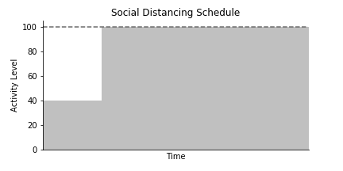
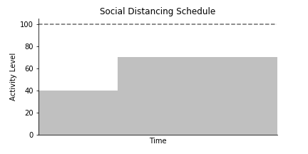
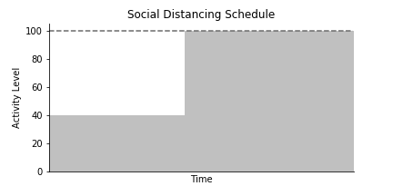
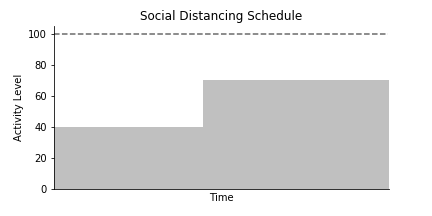
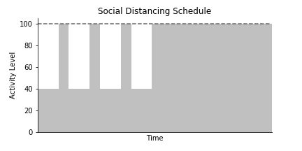
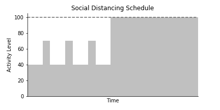

## Simulation: "Flatten the Curve"  
In this repo, we investigate:
- Impact of Social Distancing on "Flattening the Curve"  
- Influence of the Duration of One-shot Social Distancing  
- Efficacy of the Lightswitch Method (cyclic approach to social distancing, described [here](https://covid-measures.github.io/) by Marissa Childs et al)  
  
---  

### List of experiments  
- No Social Distancing (Activity Level 100%)  
- Social Distancing: Continuous
    - Activity Level 70%  
    - Activity Level 40%  
- Social Distancing: On-shot (Short-term)  
    - Activity Level 40% -> 100%  
    - Activity Level 40% -> 70%  
- Social Distancing: On-shot (Mid-term)  
    - Activity Level 40% -> 100%  
    - Activity Level 40% -> 70%  
- Social Distancing: On-shot (Long-term)  
    - Activity Level 40% -> 100%  
    - Activity Level 40% -> 70%  
- Social Distancing: Lightswitch (Cyclic social distancing)  
    - Activity Level 40% -> 100% (Repeated)  
    - Activity Level 40% -> 70% (Repeated) -> 100%  
  
---  
  
### Color code in simulations:  
- Healthy person is shown in light gray  
- Infected person is shown in red  
- Recoverd person is shown in green  
- Dead person is hidden but displayed in dark gray in counter and stacked area chart  
  
---  
  
### TL;DR  
  
- Social distancing works for flattening the curve.  
- If we quit social distancing too early, we could still see a resurgence.  
- Lightswich method could potentially reduce the total social distancing period.  
  
  
  
Note: these simulations are vastly oversimplified and should not be readily applied to COVID-19 decision making.  

---  
### Experiments
  
#### No Social Distancing (Activity Level 100%)  
  
  
  
　　
<!--    -->
　　
#### Social Distancing: Continuous  

- Activity Level 70%  
  
  
  

- Activity Level 40%  
  
  
  

<!--    -->

#### Social Distancing: On-shot (Short-term) 

- Activity Level 40% -> 100%  
  
  

- Activity Level 40% -> 70%  
  
  
  

<!--    -->

#### Social Distancing: One-shot (Mid-term)  

- Activity Level 40% -> 100%  
  
  
  

- Activity Level 40% -> 70%  
  
  
  

<!--    -->

#### Social Distancing: One-shot (Long-term)  

- Activity Level 40% -> 100%  
  
  
  

- Activity Level 40% -> 70%  
  
  
  

<!--    -->

#### Social Distancing: Lightswitch (Cyclic Social Distancing)  

- Activity Level 40% -> 100% (Repeated)  

  
  

- Activity Level 40% -> 70% (Repeated) -> 100%  
  
  
  

<!--    -->

---
  
### Requirements  
  
- python (`v3.6.9` was used)  
- numpy (`v1.17.2` was used)  
- matplotlib (`v3.1.1` was used)  
  
---  
  
### Link to abbreviated version of interactive:  
  
- [Notebook](https://nbviewer.jupyter.org/github/rikiyay/covid19/blob/master/notebook/flatten_the_curve.ipynb?flush_cache=true)  
- [HTML](https://htmlpreview.github.io/?https://github.com/rikiyay/covid19/blob/master/notebook/flatten_the_curve.html)  
- [Slide](https://htmlpreview.github.io/?https://github.com/rikiyay/covid19/blob/master/notebook/flatten_the_curve.slides.html)  
  
---  
  
### Acknowledgements  
  
This repo is  
- Inspired by the simulation in [this Washington Post article](https://www.washingtonpost.com/graphics/2020/world/corona-simulator/) by Harry Stevens  
- Based on [this elastic collision implementation](https://github.com/xnx/collision) by Christian Hill  