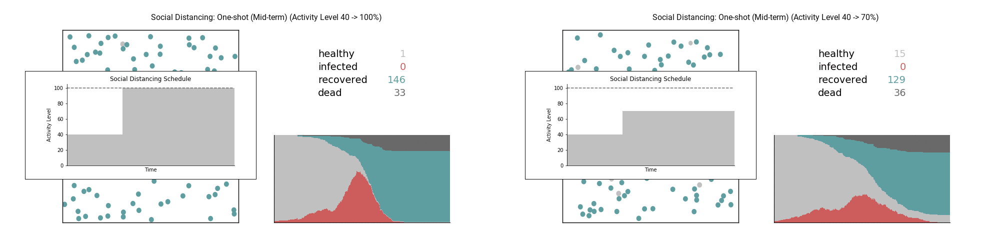

## Simulation of "Flatten the Curve"  
In this repo, we investigate:
- Impact of Social Distancing  
- Influence of Period of Social Distancing  
- Efficacy of Lightswitch Method (described [here](https://covid-measures.github.io/) by Marissa Childs et al)  
  
---  

- No Social Distancing  
  
  

- Social Distancing: Whole Period  

    - Activity Level 70%  
  

    - Activity Level 40%  
  

  

- Social Distancing: Early Stop  

    - Activity Level 40% -> 100%  
  

    - Activity Level 40% -> 70%  
  

  

- Social Distancing: Mid Stop  

    - Activity Level 40% -> 100%  
  

    - Activity Level 40% -> 70%  
  

  

- Social Distancing: Late Stop  

    - Activity Level 40% -> 100%  
  

    - Activity Level 40% -> 70%  
  

  

- Social Distancing: Lightswitch  

    - Activity Level 40% -> 100%  
  

    - Activity Level 40% -> 70%  
  

  

- Summary

 

---  
  
Link to abbreviated version of interactive:  
- [Notebook](https://nbviewer.jupyter.org/github/rikiyay/covid19/blob/master/flatten_the_curve.ipynb?flush_cache=true)  
- [HTML](https://htmlpreview.github.io/?https://github.com/rikiyay/covid19/blob/master/flatten_the_curve.html)  
- [Slide](https://htmlpreview.github.io/?https://github.com/rikiyay/covid19/blob/master/flatten_the_curve.slides.html)  
  
---  
  
Inspired by the simulation in [this Washington Post article](https://www.washingtonpost.com/graphics/2020/world/corona-simulator/) by Harry Stevens  
Reference to [this implementation](https://github.com/xnx/collision) of elastic collision by Christian Hill  